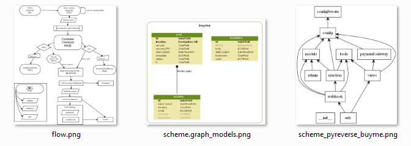

# buyme
Coinbase payments made easy.

Django app to buy time with BTC payments.

= Learning how to properly include **Coinbase checkouts**, incl. reacting to webhook callback data. 

## quickstart

Prepare server:

    apt-get update && apt-get -y upgrade
    apt-get install -y sudo nano lynx tree screen dos2unix wget curl python-pip git 
    sudo pip install -U pip
    sudo pip install Django iptools requests jsonfield coinbase

Clone and configure this repo:

    git clone https://github.com/drandreaskrueger/buyme.git
    cd buyme
    nano buyme/configPrivate.py

Fill in your API_KEY and API_SECRET, see [configure.md#api-key-for-coinbase-access] (https://github.com/drandreaskrueger/buyme/blob/master/_how-to/configure.md#api-key-for-coinbase-access). Forget email, for now. Initialize Django & DB: 

    python manage.py makemigrations buyme
    python manage.py migrate
    python manage.py createsuperuser
    python manage.py collectstatic
    
Run server: 

	python manage.py runserver 0.0.0.0:8000
	
Open in browser (change to your IP address):

* http://208.68.38.174:8000/buyme
* http://208.68.38.174:8000/admin 
    
## More information:

See [_how-to/README.md](_how-to/README.md) for diagrams, and manuals.

## what you might want to edit:
* [buyme/](buyme/) = django app
  * [config.py](buyme/config.py) = constants that influence the app 
  * [configPrivate.py](buyme/configPrivate.py) = coinbase & email credentials
  * [templates/](buyme/templates/) = html template of buyme/-page with form
* [djangosite/](djangosite/) = django project, see settings.py 

## donation ware!
(C) 2016 Andreas Krueger  
If you like this, show it: [BTC] 1JjSXcUKEmZGTvdC9BGbM6RrkGVdApape5  
