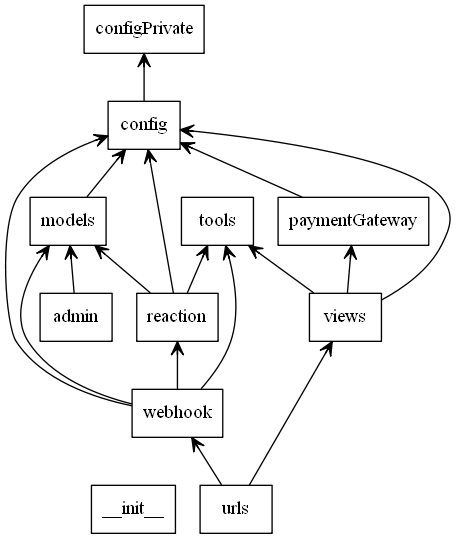
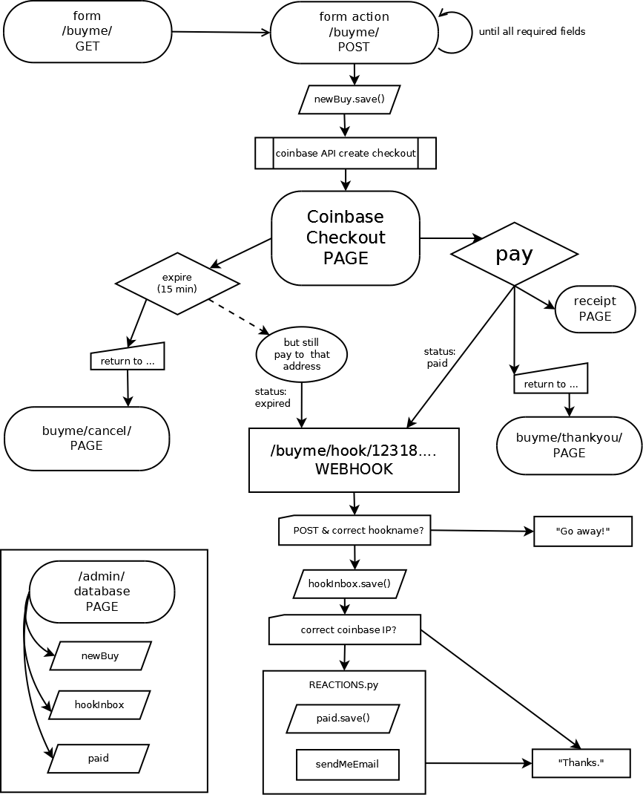
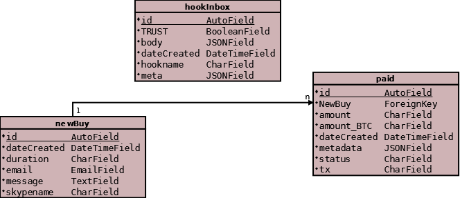
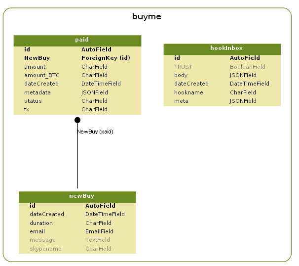

# Background infos

Diagrams:
* [Python modules](#python-modules) - how the .py call each other.
* [Flow](#flowchart) - how the user navigates, and what action is triggered.
* [Database tables](#database-tables).

README files
* [../README](../README.md) = quickstart.
* [configure](configure.md) the app, and your coinbase account.
* [URLs](URLs.md) to try (for testing & debugging).

Go deeper:
* [VPS](VPS.md) = get your own cheap server.
* [django](django.md) = how I created the django app.
* [TODO](TODO.md) for you, and me.

## Diagrams

### Python modules 

created with 'pyreverse'.

### Flowchart

created manually with 'Dia'.

### Database tables

  
created with Django app 'django-dia'.

  
created with Django app 'django-extension' --> 'graph_models'.

