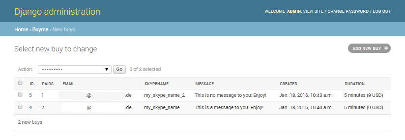
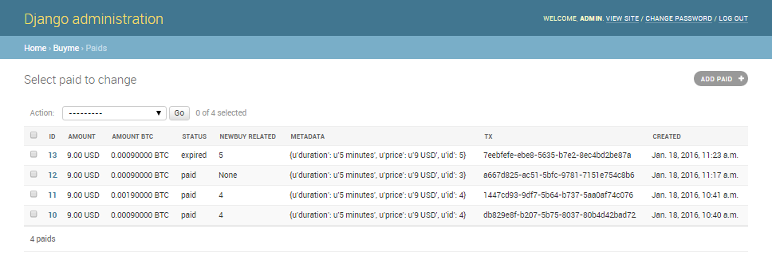
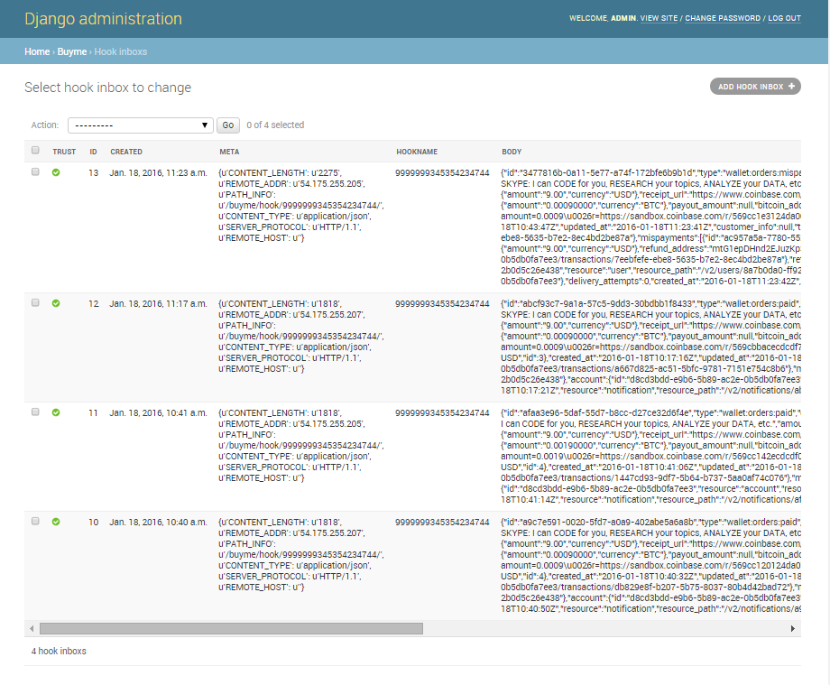

# output
### notification examples:
* [correct payment](notification_correctPayment.txt), and [same as email](notification_correctPayment.email.txt).
* [mispayment](notification_mispayment.txt) (paying after expired), and [same as email](notification_mispayment.email.txt).

### admin pages
These are screenshots of the admin pages: 

#### Screenshots:

admin/buyme/newbuy/  

admin/buyme/paid/  

admin/buyme/hookinbox/  

 
For the data scheme, see [_how-to#database-tables](../_how-to#database-tables).
In [_how-to#flowchart](../_how-to#flowchart) you can see where and when they get .save()'d. 
